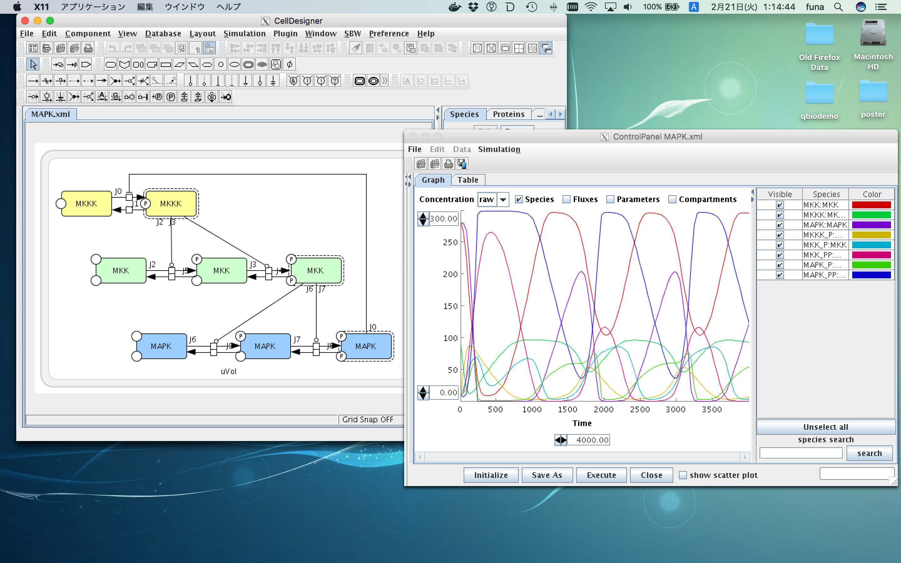

# Dockerfile for CellDesigner
Dockerfile and some shell scripts in this repository will help you execute CellDesigner (for Linux 64bit) on your MacOSX machine.
You have to manually download [CellDesigner](http://celldesigner.org/) and place it somewhere before you use this Dockerfile.



## How to use
### Requirements
Usually, you do not have to use docker when you want to launch CellDesigner on your computer.
This configuration file and scripts are for only special case that one wants to execute
CellDesigner for Linux 64bit on MacOSX machine (yes, I know it's special case, but I needed it ;-).
I have tested this script with [Docker for Mac](https://www.docker.com/products/docker#/mac).

### Download and setup
#### Clone this project
```sh
cd ~/git/
git clone https://github.com/funasoul/docker-celldesigner
cd docker-celldesigner/
```

#### Install XQuartz and socat
```sh
sudo port selfupdate
sudo port install xorg-server socat
```
Of course, you can install XQuartz and socat with homebrew.

#### Setup XQuartz
```sh
open -a /Applications/MacPorts/X11.app
```
Naviagte to [X11] -> [Preferences...] and then enable ***Authenticate connections*** and ***Allow connections from network clients***.

#### Build Docker image from Dockerfile
```sh
./00install.sh
```
Usually, you only have to run this script once.

### Launch CellDesigner through docker
```sh
./00run.sh
```
That's it!
